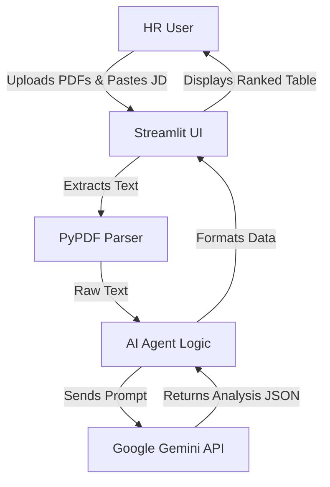

# 📄 AI Resume Screening Agent

## 📌 Overview
The **AI Resume Screening Agent** is an intelligent tool designed to streamline the recruitment process. It allows HR professionals to upload multiple PDF resumes and compare them against a specific Job Description (JD). The agent uses **Google Gemini 2.0 Flash** to analyze each resume, score candidates, and provide detailed feedback on their suitability.

## 🚀 Features
- **Bulk Resume Upload:** Upload multiple PDF resumes at once.
- **AI-Powered Analysis:** Uses advanced LLMs to understand context, not just keyword matching.
- **Smart Scoring:** Ranks candidates from 0-100 based on JD alignment.
- **Detailed Feedback:** Provides a summary of why a candidate matches and lists missing critical keywords.
- **Robust Fallback:** Automatically switches between available Gemini models to ensure reliability.

## 🛠️ Tech Stack
- **Frontend:** Streamlit
- **AI Model:** Google Gemini (via `google-generativeai`)
- **PDF Processing:** PyPDF
- **Language:** Python 3.13

## 🏗️ Architecture


## ⚙️ Setup & Installation

1.  **Clone the Repository** (or download the source code).
2.  **Install Dependencies:**
    ```bash
    pip install -r requirements.txt
    ```
3.  **Configure API Key:**
    - Create a `.env` file in the root directory.
    - Add your Google Gemini API Key:
        ```
        GOOGLE_API_KEY=your_api_key_here
        ```
    - *Alternatively, you can enter the key in the app sidebar.*

## 🏃‍♂️ How to Run
Double-click `run_app.bat` OR run the following command in your terminal:
```bash
streamlit run app.py
```

## 📂 Project Structure
- `app.py`: Main application logic.
- `requirements.txt`: List of dependencies.
- `.env`: Configuration file for API keys.
